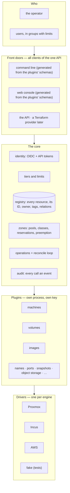
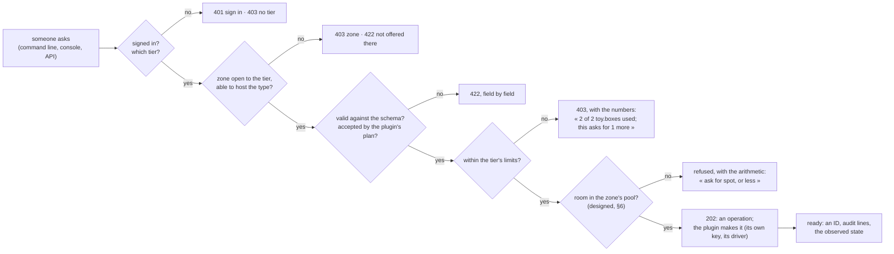

# Le Hangar — architecture

*A small, self-hosted cloud control plane — a brain with an API — that turns
requests (« a machine of this size, this disk, this image ») into resources on
the hypervisors you already own, within limits set per group, through plugins
that each hold their own key. It knows which capacity is guaranteed and which
is borrowed, gives borrowed room back the moment a priority guest needs it,
and puts idle machines to sleep.*

This document is the design. Each section says whether it is **built** (in
this repository, tested) or **designed** (agreed, not yet written). The
[OpenAPI document](api/openapi.yaml) and the
[plugin protocol](proto/hangar/plugin/v1/plugin.proto) are the contracts;
where this page and they disagree, they win.

| part | status |
|---|---|
| The core: identity (OIDC + API tokens), tiers and limits, the registry, operations, reconcile, audit, the plugin host | **built** |
| The plugin protocol and its SDK; the fake driver; the toy plugin | **built** |
| The API (`/v1`), `/healthz`, `/metrics`, `/openapi.json` | **built** |
| Zones' capacity: pools, classes, reservations, holds, the claim, waking; the Proxmox VE hook (`hangar-hook`) | **built** (§6) — proved on a throwaway Proxmox VE |
| Idle machines put to sleep, awake hours counted against a tier, keep awake | designed (§6, power) |
| The machines plugin (machines, key pairs); the Proxmox VE driver; references between resources | **built** (§7, §5, §4) — proved on a throwaway Proxmox VE ([docs/proxmox.md](docs/proxmox.md)) |
| The volumes plugin (volumes, parked on a shelf where the engine keeps no disk without a guest); attachments between resources | **built** (§7, §5, §4) — proved on a throwaway Proxmox VE |
| The images plugin (baked from a recipe, saved from a stopped machine, shared, retired); resources shared with others | **built** (§7, §5, §4) — proved on a throwaway Proxmox VE |
| Schedules: a create on the brain's own clock, in the name of the one it names — a recipe baked again every week; `@<schedule>` names the newest usable one; the older ones let go of (§3, §4, §7) | **built** — proved on a throwaway Proxmox VE |
| The command line generated from the schemas: sign-in by the device flow, every type's commands, `apply` of a spec file; a change's plan (§2, §4) | **built** — proved on a throwaway Proxmox VE and a throwaway identity provider ([docs/cli.md](docs/cli.md)) |
| The console generated from the schemas; a rebuild in `apply` (a field set at birth, made again) | designed (§2) |
| Names, ports, snapshots, object storage, databases; the Incus and AWS drivers | designed (§7) |

---

## 1. What it is — for anyone

**A cloud provider's control plane for a handful of machines**: a home lab,
a club, a small office. People sign in with the identity provider they
already run, ask for machines, volumes and images (and, through plugins,
anything else), and get them within their group's limits — on the engines
they already own, through drivers. **The AWS mindset, not the AWS wire**:
self-service, an API first, resources with IDs, types, images, user data,
tags, on-demand and spot — no EC2 API clone.

**Not in scope, said plainly:** not a hypervisor (it drives yours); not an
AWS API clone; no money billing (the unit of cost is *awake hours*); no
highly-available brain (one brain, its database backed up).

**Why Go:** the engines' client libraries are Go (Incus's own client, the
AWS SDK, Proxmox API clients), and a single static binary runs in a
`scratch` image.

## 2. Five layers



**One binary.** `hangar serve` is the brain; `hangar check` starts every
plugin, holds the config against what they declare and stops (the service is
its own checker); `hangar token create` makes the first API token on the
brain's host, before any identity provider is wired; `hangar plugin <name>`
is a built-in plugin's process — the core starts it itself, as a separate
process with its own credential, exactly as it starts a third party's
program. Being compiled into the same file changes nothing about the walls
between them.

**The doors are generated.** Every type a plugin declares comes with the JSON
Schema of its spec and of each action's params; `GET /v1/types` serves them,
and the command line's flags and the console's forms are drawn from them — a
new plugin appears in both without a line of their code changing.

**The command line is built** ([docs/cli.md](docs/cli.md)): the same binary,
a client of the API like any other. `hangar login` asks the brain where people
sign in (`GET /v1/signin`) and runs the **device flow** (RFC 8628) at the
operator's provider, with the brain's own client id — a public client: the
brain holds no client secret, it only reads tokens; the refresh token is kept
in a `0600` file, the ID token sent and refreshed, revoked at `logout`. Every
type is `hangar <type> create|list|get|delete|<action>`, its flags its schema's
top-level properties. **`hangar apply`** makes a spec file true: each entry one
resource in its type's words, a reference an id, `@<schedule>` or another entry
(made in that order); the brain is the state (the tags `apply:set` and
`apply:name`, the caller's own resources only); what is missing is created,
what differs brought there by **the steps its plugin names** (§4, a change's
plan), what left the file deleted after asking; a field set at birth that
differs stops everything before anything changes. *(Designed: the console;
**a rebuild** — that field's resource made again, its attached volumes carried
across, shown in the plan and asked.)*

## 3. The core — what never changes when a service is added **(built)**

| piece | what it does | built with |
|---|---|---|
| **Identity** | a bearer token signed by the operator's OIDC provider for the configured client id (its `groups` claim maps a person to a **tier**), or an API token `hgr_…` for automation — only its hash kept, expiring, read-only or read-write, carrying its owner's groups as they were when it was made; **a token cannot make tokens**. The provider is reached on the first token, never at start-up | `coreos/go-oidc` |
| **Tiers and limits** | a tier = a line of limits per plugin dimension (§7); the **first** tier in the file whose groups a person is in is theirs; a dimension a tier does not name is allowed **nothing**; the core counts usage and refuses what exceeds it, **with the numbers** | data (YAML) |
| **Registry** | every resource: an ID in AWS's style (`box-0123456789abcdef0`: a prefix, seventeen hex digits), type, owner, zone, state, desired spec, observed state, tags, what it holds per dimension, relations; a deleted resource keeps its row | SQLite (WAL, pure Go) |
| **The API** | REST + JSON, OpenAPI 3.1, spec first; **client tokens** on every create, delete and action (AWS's `ClientToken`: a retry returns the first operation, a reused token for another request is refused); long actions return an **operation** to poll or wait on; every refusal an RFC 9457 problem | `net/http` |
| **Operations + reconcile** | an operation is written before the plugin is called and ended after; one the brain died during is **run again at the next start** (plugins are idempotent on the resource id); a loop compares every settled resource with its engine: in sync, **repaired**, **drifted** (reported) or **lost** (and found again) | the core |
| **Zones** | a zone = an engine connection (driver, endpoint, options); a plugin is enabled per zone and reports what its driver can do there (§5) | data |
| **Schedules** | a create the brain asks for by itself, on a cron line in a time zone, **in the name of the subject and groups the operator's file names — within that tier's limits**, as a person would; what it makes is tagged `hangar:schedule=<name>`. **One at a time** (a run while the last is still being made is skipped, as a Kubernetes CronJob's `Forbid`); a run the brain missed comes **once**, late; a new schedule waits for its first time; each run's client token is its own, so a brain that died between the ask and writing it down gets the first answer again. **What it keeps:** the `keep` newest usable ones (default 2) stay as they are; an older usable one is given the schedule's `retire` action — only once newer ones are usable, never before —, and one that is not usable (retired, failed) is deleted once a newer one is usable and **nothing names it any more** (AWS Image Builder's lifecycle: deprecate, then delete; the engine's own refusal the net under it). What could not be let go of is tried again at the next run. `hangar_schedule_runs_total{schedule,result}` and an audit line per run and per letting-go | `internal/cron` (five fields, names, steps; Vixie's day rule; a skipped hour comes an hour late, a doubled one once) |
| **Audit** | one structured line per API call — who, through which credential, which resource, the result, why refused — plus one per operation's end, per plugin event, per reconcile finding; JSON on stdout, `"kind":"audit"` | `log/slog` |
| **Plugin host** | starts each plugin as its own process with an **empty environment**, a socket directory of its own and mutual TLS; refuses a declaration that collides with another plugin's or names a capability no driver documents; a program at a path can be pinned by its SHA-256; a plugin whose process dies is started again, and must describe itself exactly as before | HashiCorp `go-plugin` (gRPC — the model of Terraform's providers) |

### The ask — one flow for every request



**Admission is one transaction.** The plugin's plan says what the request
would hold per dimension; the core counts the owner's usage and writes the
resource in the same write transaction, one admission at a time — two
requests can never both fit in the last free unit. Only **growth** is
admitted (shrinking always fits, even over a limit lowered since), and only a
**changed** choice is checked (a start is never refused because the tier's
list moved). A resource holds what it holds while it is `creating`, `ready`,
`updating`, `deleting` or `lost`; `deleted` and `failed` hold nothing.

## 4. The plugin contract **(built)**

**Everything a person can ask for is a plugin, the first ones included.** The
protocol is [`plugin.proto`](proto/hangar/plugin/v1/plugin.proto); a plugin is
a Go program calling `sdk.Serve` (see [`plugins/toy`](plugins/toy/toy.go),
the one to copy). A plugin declares, and only declares:

| a plugin declares (`Describe`) | what the core does with it |
|---|---|
| **its name**; its dimensions are spelled `<name>.<something>` | refuses a plugin that calls itself by another name than the config enables, or a dimension outside its name |
| **resource types**, each with an ID prefix and a JSON Schema (2020-12) | validates every request against the schema before the plugin sees it (offline — a `$ref` elsewhere is refused, never fetched); serves it to the doors |
| **limit dimensions**: *quantities* (summed: `machines.memory_gb`) and *choices* (a value from a set: `machines.kind`) | counts and checks them per owner and tier; a plan naming an undeclared one is refused |
| **actions** per type, each with a params schema, whether it **changes usage** (planned and admitted), and the **capabilities** it needs | exposes them in the API; offers each only in the zones whose driver has what it needs |
| **what it requires of a driver** (capability flags, §5) | refuses to use it on a zone whose driver lacks them, and says so |
| **its credential** — a description of the one secret it needs per zone | hands it that secret alone, per zone, in `Configure`; no plugin can read another's |
| **events** | writes them to the audit |

and **acts** when asked: `Configure` (open a driver per zone, report its
capabilities) · `Plan` (what a create or an action would hold — no side
effects) · `PlanChange` (the steps that bring a resource to another spec, or
the fields set at its birth — no side effects; optional) · `Create`,
`Delete`, `Act` · `Reconcile` (desired against actual).

**Four rules a plugin keeps:** (1) `Create`, `Delete` and `Act` are
**idempotent on the resource id** — the id is minted by the core before the
call, written on the engine object, and a retry finds it again; a delete of
what is gone succeeds; (2) `Plan` has no side effects; (3) an action's params
are absolute (« memory 8 », never « +2 »); (4) refusals are gRPC statuses —
`INVALID_ARGUMENT` (never as written), `FAILED_PRECONDITION` (not in the
engine's present state), `UNAVAILABLE` (the core retries).

**References.** A spec's (or an action's params') top-level property that
names other resources carries `"x-hangar-ref": "<type>"` in its schema — a
string, or an array whose items are marked (the machines plugin's
`key_pairs`). The core checks every id before the plugin is asked: a
resource of that type, **the owner's own** (someone else's reads exactly
like one that does not exist), in the same zone, ready. It records the link
(`relations`: the field's name as its kind) and hands the plugin the
resources themselves in `refs` with the plan, the create or the action — a
plugin never reads the registry, and its plan can refuse what does not fit
what is named (a disk for a container) before anything is admitted. A config
enabling a type that names a type no plugin declares is refused at start.
**Relations follow the spec**: written at the create's admission, added
from an action's planned spec at its admission, and set anew from the spec
as it ends — what the resource names now, nothing it named before.
**(built)**

**The latest: `@<schedule>`.** A reference may be written `@<schedule>`: the
core writes it as the id of the **newest usable resource that schedule
made** which the owner may name, before anything reads the spec — AWS's
`resolve:ssm:`, Google Cloud's image families. The latest is the publisher's
pointer, **never a search by name** that anyone could answer with a
look-alike (the « whoAMI » confusion: a client asking for the newest image
*named* `debian-13-*` gets an attacker's). The request keeps the id: a
machine says what it was born from, and never moves under it. An image
retired by hand drops out of it: the latest is then the one before. The
audit line says what it stood for (`resolved`). **(built)**

**Usability.** A resource can exist and not be usable yet — an image being
baked (AWS: `pending`, then `available`). **The plugin says so** with every
create, action and reconcile: why a new request may not name it, in one word
(`pending`, `waiting`, `failed`, `retired`), and whether it is still being
made; absent = usable. The core refuses a reference to one that is not, in
that word, and shows it (`unusable`, `pending`). A state re-read at every
reconcile, not an event a restart could lose. **A plugin may say a resource
holds less than it was admitted for** (a bake that failed holds nothing, as a
create that did not happen): the core keeps the smaller amount per
dimension — growth is admitted, never reported. **(built)**

**Attachments.** A reference whose schema also carries `"x-hangar-attached":
true` is an attachment: on the engine, the resource lives inside the one it
names (a volume plugged into a machine). **Neither end is deleted while it
is** — 409 `attached`, « m-… has vol-… attached: detach it first — it keeps
its data » — because the engine would take the attached one's data along. A
lost resource binds nothing (else a machine the engine lost could never be
let go of). The drivers keep the same rule underneath: a guest holding a
volume refuses its delete. **(built)**

**Shares.** A type whose schema marks one top-level property
`"x-hangar-share": true` (an array of strings: group names, `"*"` =
everyone) is one an owner may open to others. The core keeps whom each
resource is shared with **as its spec says**, like its relations (written at
the create, set anew as each operation ends and when reconcile moves a
spec). Someone in one of those groups — anyone, for `*` — **sees it**
(get, and the listing: one's own and what is shared with one's groups) and
**names it** in their own requests — a reference that is **no attachment**
(an attachment lives inside what it names: nobody plugs a disk into someone
else's machine). **Only its owner (or an operator) changes or deletes it**:
403 `shared`, « img-… is bob's, shared with you to see and use ». **A person
shares only with groups they are in**, or with everyone — which a tier
allows or not by the plugin's own choice dimension (the images plugin's
`images.visibility`); an operator shares with any group. **(built)**

**A plugin sees the room a resource holds** (`Resource.room`): a resource
whose room changes on its own — a bake borrows its builder's memory until
its image is made, then takes none — returns its spec and new room from
reconcile, only when they differ. **(built)**

**A change's plan.** A resource changes through its type's actions; to bring
one to a whole new spec — what `apply` does — the core asks **its plugin**
(`PlanChange`): the steps, in order (« resize {memory_gb: 48} »; « detach,
then attach {machine, mount} » for a new path), or the fields that differ and
no action changes — set at its birth. The plugin knows its fields; the core
knows none. `POST /v1/resources/{id}/plan` answers it and changes nothing;
each step is then asked as any action is (planned, admitted, audited). The
spec is whole (a field left out is wanted at its default) and checked as a
create's; **only what it names anew must be usable** (a machine keeps the
image it was born from, retired or not); **a reference written `@<schedule>`
is where the resource already is when that schedule made what it names** —
the latest is what a *new* machine is born from, and never moves one that
exists (I22's rule, kept by the core). A plugin that leaves `PlanChange`
unimplemented has types that change only through their actions, asked one by
one. **(built)**

**A reference to a type no enabled plugin declares** is logged at start and
refused at the request (« no plugin here makes the type image ») — the rest of the
type works: a machine names an image by id only where images are made, and
by the operator's names everywhere. **(built)**

**Adding a plugin = three things:** the plugin (built in, or a program of its
own at a path, pinned by its SHA-256), one config block enabling it on zones,
its credential per zone (from a file or an environment variable of the
core's — never written in the config).

## 5. Drivers — the engines and what they can do

A plugin talks to an engine through a driver (`driver` package: a registry by
name, like `database/sql`'s). Each driver advertises **capability flags**; the
core and the plugins use the flags, never the engine's name. A driver may only
advertise the documented flags.

| capability flag | Proxmox | Incus | AWS | fake |
|---|---|---|---|---|
| `kind.container` | yes (LXC) | yes | no | yes |
| `kind.vm` | yes (QEMU) | yes | yes (EC2) | yes |
| `resize.live.memory_down` | **containers only** | containers | no | yes |
| `resize.live.cpu_cap` | yes (VM `cpulimit`, CT `cores`/`cpulimit`) | yes | no | yes |
| `volume.move_between_guests` | yes (`target-vmid`, both guests on one node) | yes | yes (EBS) | yes |
| `guest.suspend_to_disk` | VMs without a passed-through device | yes | hibernate | yes |
| `guest.tags` | yes | yes (config keys) | yes | yes |
| `hook.pre_start` | yes (hookscript; **a failing one aborts the start**) | no (the core admits instead) | no | yes |
| `gpu.shared` / `gpu.passthrough` | device nodes / PCI mapping | yes / yes | instance types | — |
| `fence.pool` (a credential limited to the product's guests) | yes (a pool + a role) | yes (a project) | yes (IAM + tags) | yes |

**The fake driver is built** and ships first: it lets the whole core and
every plugin be proved with no hypervisor. Its zone's endpoint is empty (in
memory) or a JSON file — and then **the file is the engine**: every call reads
it first, so editing it by hand is changing the engine behind the brain's
back, which is what reconcile exists to catch. Its options narrow its
capabilities (to prove what a zone without one refuses) and can demand a
credential (to prove the plugin received its own).

**The guests facet** (`driver.Guests`: create, find, list, delete, power,
reboot, resize — create idempotent on the core's id) carries a guest's name,
image (the engine's own name for it, per kind), root disk, public keys, user
data, tags, holds and a CPU cap; it reports its node, addresses and what a
running guest holds. **`Traits(kind)`** says what a
guest of one kind takes (user data) and changes while it runs (cores, memory
up, memory down) — finer than a flag, which speaks for the whole engine: on
Proxmox a container changes everything live and a VM only grows its memory.
**The watcher facet** (`driver.Watcher`) reads what a zone's reservations
wait on: a watched guest's power, a node's state, whether the zone is awake.
**The volumes facet** (`driver.Volumes`: create, find, place, resize, set
backup, delete — idempotent on the core's id) makes a volume on a guest or
parked, and places it on another guest or back parked, keeping its data,
size and backup flag; a block volume shows its guest the serial
`vol0123…` (the id without its dash, AWS's form). Where the engine keeps no
disk without a guest the driver parks one on a stopped **shelf** guest of
its owner — the plugin never sees a shelf; `CanPark` says where it cannot.
**The images facet** (`driver.Images`: bake, save, read, delete — idempotent
on the core's id) makes images: a **bake** is moved forward call by call
(its builder made and started, read, made the image or failed with its
words, let go while the zone's room is needed and started over after), a
**save** is one call (a stopped guest's system disk, refused with a volume
plugged in), a **delete** is refused while guests born from the image still
share its disk; `ImageKinds` says which kinds it makes images for.

**The Proxmox VE driver is built** ([docs/proxmox.md](docs/proxmox.md)): one
API token fenced to one pool, `fence.pool` advertised only when the token's
own permissions reach nothing else; containers from a template archive, VMs
cloned from a template found by name and fed their user data on a NoCloud
seed disc the driver writes and uploads; every long call waits for its task
(a refused start is a `200` and a failed task). It advertises `kind.*`,
`guest.tags`, `resize.live.memory_down` (containers, above what they hold),
`resize.live.cpu_cap` (`cpulimit`, live on both kinds), `hook.pre_start` (its
hook, `hangar-hook`, §6), `volume.move_between_guests` (the volumes facet: a
guest's description says which disk is which volume, since a disk is renamed
after each guest it moves to; a volume leaving a running VM rests on its
shelf, where its options are written back; one leaving a running container
is refused — [docs/proxmox.md](docs/proxmox.md#volumes)) and `fence.pool` —
the one thing its token may do outside its pools is read the power of the
guests the zone watches. It makes **images** as VM templates in the images
pool, named after their id and tagged with nothing (a clone copies its
template's tags: a machine born with an image's id would not be itself — read
on the bench): a bake's builder boots the base once with the recipe, then the
driver's own last step, and says `done` or `failed` by its host name through
the guest agent ([docs/proxmox.md](docs/proxmox.md#images)).
*(The Incus and AWS drivers are designed.)*

## 6. Zones, pools, classes, reservations, preemption **(built)**

**A zone** is where machines run: one engine connection, its nodes, one
network (a bridge or vnet, an address range, a gateway, resolvers — the
product's IPAM hands out addresses, *designed*), and its capacity rules, in
the zone's `room`:

```yaml
zones:
  - name: lab
    room:
      memory_gb: 62          # what the product's resources may count on here
      grace: 10m             # see "the claim"
      reservations:
        - {name: host,     memory_gb: 15}                          # always
        - {name: priority, memory_gb: 32, while_running: "4100"}  # a guest of the operator's
        - {name: failover, memory_gb: 10, while_down: node-b}      # a node's guests land here
    wake:                    # a zone that sleeps
      url: https://power.example.com/api/targets/node-c/wake
      body: '{"wait": true}'
      headers: {Authorization: {file: /run/secrets/wake}}
```

- **Reservations** — room kept for someone else, **with a condition**:
  always (none written), `while_running: <guest>`, `while_down: <node>`.
  They are how a zone shares hardware with things more important than it.
- **Two pools follow**: **guaranteed** = the memory less every reservation,
  as if all were in force — what can be *promised*; **spot** = the room the
  conditional reservations keep while none of them is — what can be
  *lent*. Unused guaranteed room is never lent: a promise never waits for
  a borrower to leave. **When one conditional reservation is in force it
  takes the whole spot pool back** — exact for a zone with one, erring on
  the side of the one that needs the room with several (a finer split is a
  flip trigger, not built).
- **What a resource takes** is its plugin's to say, per plan: MiB booked in
  the guaranteed pool while it lives, MiB borrowed from the spot pool while
  it runs, whether it will run. **Admission** is in the same transaction as
  the tier's limits, growth only: a promise beyond the guaranteed pool, or a
  borrower beyond the spot pool, is refused (409 `room`) with the
  arithmetic — « zone lab's spot pool holds 32 GB; 30 GB in use; this asks
  for 4 GB more — ask for less, or when one stops ». **While the spot pool
  is held, a resource runs on what it booked only**: a floor starts on its
  floor, one with nothing booked does not start (« held for priority (while
  guest 4100 runs): ask again when it ends, or for guaranteed room »).
- **Classes** (the machines plugin's): *guaranteed* (all booked, never
  stopped) · *spot* (all borrowed: stopped when the room is needed, started
  again when it returns — unless `resume: false`) · *guaranteed + spot*
  (only where a running guest of its kind gives memory back,
  `resize.live.memory_down`: a floor booked, a top-up that goes — it shrinks
  instead of stopping, never below what it holds, and says what it could
  not give back). `cores_beside` caps the CPU of the ones that keep running.
  **The class, floor, cap and admitted size are written on the guest as
  tags**, so the engine's node can act without the brain.
- **Holds.** While a conditional reservation is in force, the core writes
  its key on every room-taking resource of the zone (`hold` in the protocol)
  and the plugin brings each to what a hold means for it — in one order:
  the tag first (a node reading it sees the hold before its effect), spot
  stopped, floors shrunk, CPU capped; lifted in the reverse order. **A
  reservation's owner is never delayed by a refusal of ours.**
- **What a reservation waits on** is read by surveys (a plugin's `Survey`:
  its driver reads the guest's power — the one thing its credential may
  read outside its fence, and nothing more — or the node's state), at every
  reconcile pass and at start.
- **The claim — the guest's hook phones the brain first.** Before a
  reservation's guest starts, its hook calls `POST /v1/zones/{zone}/claim`
  (a token of the scope `room`, for a tier with `room: true`: it claims and
  releases, and nothing else, not even read); the brain holds the zone
  before it answers, and finishes even if the hook stopped waiting. After
  the guest stops, `release` lifts the holds and starts the spot machines
  meant to run. A claim stands for the zone's `grace` before its guest reads
  running (the start's own time), past it only while it does — **a release
  that never came** (the node lost its power) **ends there** — on a guest
  read not running; one that cannot be read keeps it (a hiccup of the
  engine's API is not a guest gone). **One room decision at a time per
  zone**: a claim or a release, and a pass's survey and holds, never overlap
  — a survey that once came mid-release took the release's own tags, not yet
  taken off, for a node acting alone.
- **The node alone.** When the brain cannot be reached (or refuses the
  hook's token), the hook does on its node what the brain would, from the
  tags alone, and never refuses its guest's start; after the stop it gives
  back what it took. The brain, back, reads the guest's power: running, it
  keeps the holds; the node's hold on a guest not yet running is **adopted**
  as a claim for the grace.
- **Admission on the node, whoever starts.** On an engine with
  `hook.pre_start` the same hook, set on the images' templates and inherited
  by every clone, refuses a start above the size admitted, a spot machine's
  while a priority guest of the node has the room, a floor's above its
  floor then — from the brain, the engine's console, or its command line.
- **Waking.** A zone that sleeps declares a `wake` webhook; before anything
  starts there (a create, a start), the core asks whether it is awake, calls
  the webhook when it is not, and waits for it to answer (`timeout`). A
  reconcile never wakes a zone: while it sleeps its resources are not
  judged.
- **Power — designed:** the core stops each machine idle for its
  `idle_after` (read from the engine's own counters: CPU and network), and
  counts **awake hours** against the owner's tier (a limit per month); a
  machine can be kept awake, at that cost.

## 7. Every plugin — capabilities and limits (the first three **built**)

### The first three

**The machines plugin is built**, as the row below says but for four
things. The key pair type is **`keypair`** (a type's name has the shape of an
id prefix); a key pair is **imported, never generated** (the brain would hold
a private key). **Console** comes with the terminal in the console (it needs
a stream through the core the protocol does not carry yet). **The classes,
`floor_gb`, `cores_beside` and `resume`** are built with §6's room; **awake
hours, keep awake and `idle_after`** come with §6's power; **GPU** and
**`peers`** later. A machine holds its size against its tier while it
exists, running or not; against its zone, as its class says (§6).

**The images plugin is built**, as its row says. An
image (`img-…`) is **baked** from a recipe of the operator's, or **saved**
from a stopped machine of its owner's — its system disk alone, never its
volumes (an image may be shared: no one's data goes with it). A machine is
born from one by id (`image_id`, beside the operator's names in `image`):
its own, or one shared with it, **available** and not retired; its disk at
least the image's. **A bake takes minutes, so it is not one call**: the
create answers at once (`pending`, as AWS says of an image being made) and
the brain's reconcile carries it forward — `available`, or `failed` with the
words of the builder's own first boot. **A builder borrows spot room while it
works** (the recipe's `memory_mb`): it wakes a sleeping zone, is refused while
the zone's room is held, and is let go at once when the room is needed — its
bake **starts over by itself** once the room is back, never counted as a
failure. **A bake that fails on its own is never retried blindly**, as the
clouds do (AWS Batch retries a job whose host was reclaimed, never one whose
script failed): `rebake` runs it again, from the recipe as it is then. A
builder that keeps stopping before it finishes, unasked, fails its bake at
the third time. **A failed bake holds nothing** (not its owner's count, not
its size), as a create that did not happen; a rebake is admitted anew. **An image is private at birth**; `share` opens it (§4,
shares); `retire` stops new machines being born from it — those born from it
run on. **A delete is refused by the engine while machines born from it still
share its disk** (Proxmox VE's linked clones), naming them: retire it
meanwhile. A recipe is copied into each image it bakes — an image says what
it was made from, and whoever sees it sees its recipe: no secret in one.

**The volumes plugin is built**, as its row says. A volume's **content** is
fixed at birth: `block` (a disk its VM formats itself) or `filesystem` (a
directory its container mounts at `mount`) — filesystem when a mount is
given. It names its machine (`machine`, an attachment, §4); a volume on none
is **parked**, and a filesystem volume keeps its last path for its next
attach. **Backups are a size budget**: `volumes.backup_gb` counts the sizes
of the volumes the engine's backups take — a tier that names no budget backs
up nothing, and no one fills the backup store. A running container lets go
of no volume (stop it first); a running VM does, live. Every action is
planned (the refusals come back before anything is admitted, with the
numbers), and its spec written at its admission.

| plugin | resources | actions | limit dimensions (per tier) | driver needs |
|---|---|---|---|---|
| **machines** | **`m-…`**: name, zone, **kind** (container / VM), **type** (AWS names — `t3.medium` = 2 vCPU / 4 G — or the operator's aliases, or free cores + memory), **image**, **class**, `cores_beside`, `floor` (guaranteed + spot), **user data** (cloud-init), **key pairs** (public keys; `kp-…`), **tags**, `idle_after`, GPU (none / shared / whole), `peers` group | create · start · stop · reboot · resize · console (serial / terminal) · delete · keep awake (costs awake hours) | count · vCPU · memory GB · awake hours a month · kinds allowed · classes allowed · zones allowed · GPU allowed | `kind.*`, `guest.tags`, `resize.live.*` for resize, `hook.pre_start` or core admission |
| **volumes** | **`vol-…`**: size, content (block / filesystem), backup yes/no, the machine it is attached to and its path there, tags | create · attach · detach · **move** (to another machine of the same owner) · resize (grow) · set_backup · delete | count · total GB · **backed-up GB** | `volume.move_between_guests`, `fence.pool`; where the engine keeps no disk without a guest, an unattached volume parks on a stopped **« shelf » guest** of its owner |
| **images** | **`img-…`**: name, family, kind, size, whom it is shared with (`shared_with`: groups, `*` = everyone), retired, the recipe it came from (`from`) or the machine it was saved from; observed: `pending` → `available` \| `failed` (its words), `waiting` while the zone's room is held, its engine form per kind | **bake** (create from a `recipe`) · **save** (create from a stopped `machine`) · share · retire · rebake · delete | `images.count` · `images.size_gb` (one's own) · choices `images.source` (recipe, machine) and `images.visibility` (private, shared, public) | the images facet (`driver.Images`): a bake moved forward call by call, a save, a delete refused under linked clones — Proxmox VE: VM templates in the images pool, a builder VM per bake |

**Recipes** (for `bake`), in the plugin's settings: a base on the engine per
kind (Proxmox VE: a disk image on an import storage, or a template's name —
an image of the product's included, so recipes layer), a disk size, the
builder's cores, memory and time to finish, and its first boot — a
`#cloud-config` or a `#!` script — to which the driver adds its own last step
(the disk made ready to be cloned). An operator writes their own (their
agent, their monitoring).

**Baked again by themselves, per recipe** — a core schedule (§3) naming
the recipe; a recipe no schedule names is baked only when asked. The
operator's file:

```yaml
schedules:
  - name: debian-13               # "@debian-13" names the newest usable one
    cron: "0 3 * * sun"           # minute hour day-of-month month day-of-week
    time_zone: Europe/Paris       # default UTC
    as: {subject: recipes, groups: [image-makers]}   # whose name, whose tier
    create: {type: image, zone: lab, spec: {recipe: debian-13, shared_with: ["*"]}}
    keep: 2                       # the newest usable ones, as they are
    retire: retire                # then retired; deleted once no machine is born from them
```

Every Sunday a new image, shared with everyone; a machine asks for
`image_id: "@debian-13"` and is born from the newest; once two newer are
usable, the older ones are retired and, when no machine is born from them
any more, deleted — a failed bake too, once a newer one works. Size the
schedule's tier for `keep`, plus the retired ones machines are still born
from, plus the one baking: over it, a run is refused with the numbers and
the audit says so.

### The next ones (each its own design, then its own release)

| plugin | resources | actions | limits | how it is driven |
|---|---|---|---|---|
| **names** | `name-…`: a host name under a domain the operator allows, pointing at a machine (A/AAAA or a reverse-proxy route) | request · point · release | names per tier · domains allowed | a DNS driver (an API-backed zone) + optionally a reverse-proxy driver for HTTPS |
| **ports** | `port-…`: a protocol + port on the operator's public address, forwarded to a machine, **for one source address at a time**, for a duration | open · extend · close | open ports per tier · hours per lease · protocols allowed | a firewall/NAT driver that keeps leases (e.g. [Le Videur](https://github.com/tomblancdev/videur)) |
| **snapshots** | `snap-…` of a machine or a volume | take · restore · delete | count · GB | engine snapshots |
| **object storage** | `bucket-…`, S3-compatible keys | create · keys · delete | buckets · GB | an S3-compatible server driver |
| **databases** | `db-…`: engine + version, a machine underneath | create · credentials · backup · delete | count · size | built on the machines plugin |
| **machines on AWS** | the machines plugin with the **AWS driver** | as machines | **money a month** per tier (the one money limit) | the AWS driver; never spends unasked |

## 8. The security model — five walls

| wall | what holds it | status |
|---|---|---|
| **1. The door** | OIDC sign-in (the operator's provider and its MFA); API tokens scoped (read / write) and expiring, never able to make tokens; the brain behind the operator's gateway (it speaks plain HTTP; TLS is the gateway's) | **built** |
| **2. The core and its plugins** | limits per tier; every call audited; **each plugin its own process, started with an empty environment, with its own credential and nothing else**; mutual TLS on its socket; a program pinned by its SHA-256; the API never returns an engine credential | **built** — the empty environment and the one-credential rule are proved by tests that run a probe plugin and read what it received |
| **3. The engine fence** | each driver's credential fenced to the product's own guests (`fence.pool`): on Proxmox a pool and a role — it cannot touch any other guest, and sees only the power of those a zone's reservations name | **built** for Proxmox: the driver reads the token's own permissions and advertises `fence.pool` only when nothing outside its pools is reachable but `VM.Audit` on a watched guest (root's token, the control, is refused with 416 reasons); the machines plugin requires it, so an unfenced zone is not one it acts on. The hook on the node needs no hypervisor credential at all: it is the node's own root, and holds only a `room` token toward the brain |
| **4. The network** | a zone's network is the operator's: the product assumes a lane where machines reach only what the operator allows, and each machine is alone on it unless two share a `peers` group | designed |
| **5. The machine** | untrusted users get **VMs** (their own kernel); containers are for trusted operators | designed (a tier's `kind` choice limit already enforces it) |

**What it cannot promise:** a hypervisor flaw lets a VM reach its host — so
**untrusted users belong on hosts that run nothing else of value**; the
brain holds the plugins' credentials — so it must never face the internet
directly, and each credential must stay fenced.

## 9. Decisions, and what was set aside

| decision | why |
|---|---|
| A control-plane product with its own database; what people create is its data, never a line in somebody's git | users must never write the operator's infrastructure repository |
| Drivers with capability flags | the engine is a choice; a plugin is written once |
| Plugins in their own processes, each with its own credential; the doors generated from their schemas | a new service costs no core change; a flawed one harms no other |
| `POST /v1/resources` with the type in the body (not `/v1/{type}`) | one collection, listed and filtered the same way it is created in; the type is data the catalogue serves |
| One binary that runs its built-in plugins as separate processes | one image, one build — and the walls between plugins unchanged |
| API tokens made on the brain's host by `hangar token create` | a first operator can start without an identity provider, and a lost provider is not a lost brain |
| A resource attached to another stops the delete of either (409 `attached`), rather than going with it or being parked by the core | nothing is lost by surprise: on the engine the volume is inside the machine, and a delete would take its data |
| Backups counted as a size per tier (`volumes.backup_gb`), not a yes or no | the backup store is finite: one person allowed backups could fill it |
| A bake answers at once (`pending`) and reconcile carries it forward, rather than one long call | a long operation holds its resource: a zone's claim for a priority guest would wait behind it |
| An interrupted bake starts over by itself; one that failed on its own waits for `rebake` | an interruption says nothing of the recipe; a failure would fail again the same way (the clouds' rule for spot interruptions) |
| An image carries its owner's system disk only; a machine with a volume plugged in is not saved | an image may be shared: no one's data may go with it |
| A person shares only with groups they are in, or with everyone as their tier allows | a share is a publication: nobody reaches people they do not belong with |
| Schedules are the core's (any type's create on a clock), in the operator's file, in the name of a subject and groups it names | a recipe baked every week and a volume snapshotted every night are one mechanism; the brain asks as a person would, within a tier |
| The latest is `@<schedule>`, resolved by the core to what that schedule made; the request keeps the id | the publisher's pointer, never a name anyone could take first; every client gets it alike; a machine never moves under its user |
| A schedule keeps its `keep` newest usable ones; older ones are retired, then deleted once nothing names them — and only once newer ones are usable | a way back stays; the store stops growing; a failed week never costs the last good image |
| Whether a resource is usable is its plugin's say, re-read at every reconcile | the core knows no plugin's states; an event would be lost by a restart |
| A failed bake holds nothing | a failure streak would otherwise fill a tier, and a schedule jam behind its own failures |
| The command line is a client of the API, generated at run time from `GET /v1/types` | a new plugin is a new command with no release of the door; the brain checks everything, the door only turns words into JSON |
| Sign-in by the device flow, with the brain's own client id (a public client) | the password and the second factor stay on the provider's page, in any browser; the brain holds no client secret; one client for every door |
| `apply` runs in the client; the brain is its state (two tags), only the caller's own resources counted | no state file to lose or share; the API stays one ask flow; an operator's listing of everyone's never becomes their plan |
| What brings a resource to a spec is its plugin's say (`PlanChange`), asked beforehand and run as ordinary actions | the plugin knows which action changes which field; every step is admitted and audited as if asked by hand |
| A resource that left the file is deleted — after asking (`--yes` for scripts; refused with no one at stdin) | the file is the whole truth, as Terraform's; nothing goes unasked |
| A field set at birth that differs stops the whole apply before anything changes; a rebuild is designed, not built | nothing is lost by surprise (a machine's disk is data); a rebuild must carry the volumes across |

**Set aside:** an EC2 API clone (nothing maintained speaks it for the engines
this targets — OpenStack's EC2 layer, CloudStack's `ec2stack`, Eucalyptus and
LocalStack are archived or retired); making Incus the only engine (it would
replace a host's hypervisor rather than drive it — it is a driver instead);
the heavy cloud stacks (OpenStack, OpenNebula, CloudStack) that own their
hosts.
